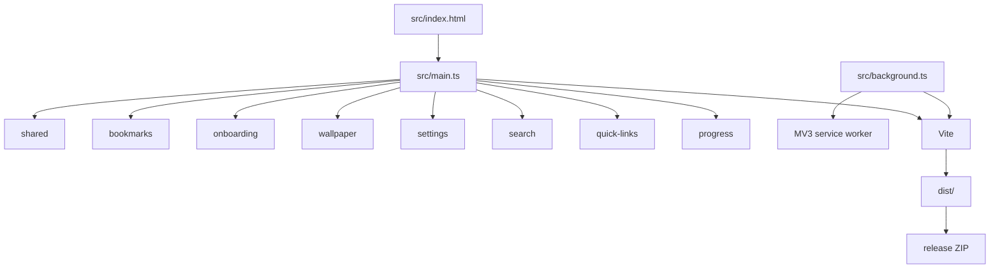

# MarkStart 工程索引

## 项目愿景

MarkStart 是 Chrome/Edge 的 MV3 新标签页扩展：将书签、搜索、快捷链接、壁纸和设置集中在一个可定制页面中。页面源码由严格 TypeScript 和 Vite 构建；发布产物仅为 `dist/` 中的 JavaScript 扩展文件。

## 架构总览

## 模块索引

| 模块 | 职责 | 入口/索引 |
| --- | --- | --- |
| [书签](src/features/bookmarks/AGENTS.md) | 书签树、目录、排序、默认目录和手势 | `features/bookmarks/page.ts` |
| [快捷链接](src/features/quick-links/AGENTS.md) | 历史、固定站点、菜单、二维码和缓存 | `features/quick-links/index.ts` |
| [搜索](src/features/search/AGENTS.md) | 搜索引擎选择与搜索 UI | `features/search/dropdown.ts` |
| [设置](src/features/settings/AGENTS.md) | 设置侧栏与偏好交互 | `features/settings/index.ts` |
| [壁纸](src/features/wallpaper/AGENTS.md) | 预设、上传、Bing 与背景持久化 | `features/wallpaper/index.ts` |
| [欢迎与提示](src/features/onboarding/AGENTS.md) | 欢迎语和功能提示 | `features/onboarding/*.ts` |
| [年度进度](src/features/progress/AGENTS.md) | 页面底部年度进度 | `features/progress/index.ts` |
| [共享](src/shared/AGENTS.md) | 国际化、图标、全局声明和类型 | `shared/*.ts` |
| [测试](tests/AGENTS.md) | Node 测试、构建与发布包契约 | `tests/*.test.ts` |
| [打包](scripts/AGENTS.md) | 发布 ZIP 创建 | `scripts/package-extension.ts` |

## 运行与开发

- 要求 Node.js 20.19+ 或 22.12+；依赖锁定于 `package-lock.json`。
- `npm run dev`：Vite watch 构建；在 Chrome/Edge 以 `dist/` 加载已解压扩展。
- `npm run build`：生成 MV3 可加载目录 `dist/`。
- `npm run package`：先构建，再生成 `release/MarkStart-<version>.zip`。
- `manifest.json` 对外入口保持 `src/index.html` 与 `src/background.js`；不要将 TypeScript 源文件写入发布包。

## 测试策略

- `npm test`：运行 `tsx --test` 测试集合。
- `npm run typecheck`：严格检查 `src/`、`tests/`、`scripts/` 和 `vite.config.mts`。
- 页面/服务 worker 改动：运行 `npm run build`，并在真实扩展页验证受影响交互。
- 发布流程改动：运行 `npm run package`；测试必须在临时目录验证 ZIP，不污染本地 `dist/` 或 `release/`。

## 编码规范

- TypeScript 为严格模式：不用 `any`、类型断言、非空断言、`@ts-ignore` 或 `@ts-expect-error`。
- 在 Chrome API、storage、消息和外部数据边界以 `unknown` 接收并窄化；类型导入使用 `import type`。
- `src/main.ts` 的副作用导入顺序是页面初始化契约；移动功能文件时同步更新入口与相关测试。
- 优先最小职责模块；DOM/Chrome 控制器与可单测的纯数据逻辑分离，避免无必要抽象。
- 页面样式入口是 `src/styles.less`：按原 styles.css 规则顺序连续切分为 `src/styles/*.less`（功能域文件 + `variables.less` 色板），import 顺序即级联顺序，不可随意重排（存在 `body,main` transition 覆盖链等同特异性依赖）；高频色值必须走 `variables.less` 变量。`output.css` 是提交进仓库的 Tailwind 生成产物，仍由 `index.html` 单独引入。

## AI 使用指引

- 先读本文件，再读目标模块的 `AGENTS.md`；`CLAUDE.md` 只负责兼容导入。
- 尊重未提交改动与 `dist/`、`release/` 忽略规则；未经用户要求不暂存、提交、推送或删除文件。
- 修改扩展行为时，以现有 MV3 页面行为为兼容基线；纯路径重组也要复核 `main.ts`、入口测试与构建产物。

## 变更记录

- 2026-08-23：样式工程化——安装 less，`styles.css`（2023 行）按功能域连续切分为 `src/styles/` 下 13 个 .less + 色板变量，入口 `styles.less`；构建产物与改造前字节级一致（同内容 hash）。
- 2026-08-23：全仓性能整改——快捷链接缓存顺序修复、书签事件合流与懒渲染、壁纸恢复先行并行与网格懒构建、搜索监听器去重与过期查询丢弃、qrcode 拆按需 chunk、构建期剥离 console.log/debug/info（保留 warn/error）。
- 2026-08-20：功能与共享代码已按领域目录重组，快捷链接已拆分为职责模块。
- 2026-08-20：建立初次 AI 上下文索引。

## 索引状态
- 上次索引：2026-08-23T15:17:22Z（@d885510）
- 基线提交：d885510f5a7b3b0e05e6ada57bcfd39769906437
- 已知缺口：未发现
- 扫描进度：已完成
